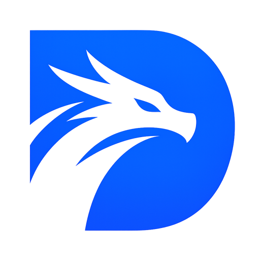

<div align="center">
  <br />
  
  <h1>Drathos</h1>
  <p><strong>DRM-Free Game Library Client</strong></p>
  <p>Self-hosted · Cross-platform · Open Source</p>

  <p>
    
    
    
    
  </p>

  <p>
    
  </p>

  <br />
</div>

<div align="center">

[Features](#features) · [Stack](#stack) · [Getting Started](#getting-started) · [Backend](https://github.com/Valt1-0/drathos-backend)

</div>

<br />

---

## What is Drathos?

Drathos is a **self-hosted, DRM-free game library client** built with Electron and React. It connects to the **[Drathos backend](https://github.com/Valt1-0/drathos-backend)** to manage and sync your game collection — no third-party DRM, no forced online account, just your games on your terms.

<br />

---

## Features

<table>
<tr><td> &nbsp;<strong>Game Library</strong></td><td>Search and browse your catalog · Filter by genre, status, playtime, multiplayer · Track each game as Backlog / Playing / Completed / Dropped</td></tr>
<tr><td> &nbsp;<strong>Game Launcher</strong></td><td>One-click launch · Wine support on Linux · Install, uninstall, open folder, create desktop shortcut · Stop a running game at any time</td></tr>
<tr><td> &nbsp;<strong>Downloads</strong></td><td>Queue-based installer with real-time progress · Pause, resume, cancel · Continues in the background while you navigate</td></tr>
<tr><td> &nbsp;<strong>Stats</strong></td><td>Total playtime, session count, recently played — all visible from the home screen</td></tr>
<tr><td> &nbsp;<strong>Collections</strong></td><td>Group games into custom collections · Cover mosaic preview · Name, icon, and description per collection</td></tr>
<tr><td> &nbsp;<strong>User Management</strong></td><td>View all users, assign roles (Admin / Moderator / Member), search and sort by playtime or activity <em>(admin only)</em></td></tr>
<tr><td> &nbsp;<strong>Settings</strong></td><td>Profile picture · Language (EN / FR / DE / ES) · 5 built-in themes · Download path, notifications, cache, SSL</td></tr>
<tr><td> &nbsp;<strong>Offline Mode</strong></td><td>All installed games stay launchable · Pending actions sync automatically when the server is back</td></tr>
</table>

<br />

---

## Getting Started

> **Pre-built releases** will be available for download on the Drathos website — coming soon.

### Prerequisites

- **Node.js** ≥ 18
- A running **[Drathos backend](https://github.com/Valt1-0/drathos-backend)** instance

### Install & Run

```bash
# Install dependencies
npm install

# Start in development mode
npm run dev
```

### Build

```bash
npm run build          # Current platform
npm run build:win      # Windows
npm run build:linux    # Linux
```

<br />

---

## Changelog

**v0.8.0** — Desktop shortcuts · Loading animations · Accessibility improvements · Disk space monitoring · Game watchdog

**v0.7.0** — User role management · User status & filters · QuickLaunch overlay · Docker build support

**v0.6.0** — Advanced game filtering · Adaptive offline detection · Notification system · Self-signed SSL support · i18n error messages

**v0.5.0** — Mod management (upload, install, uninstall) · User profiles · Connection status in settings

**v0.4.0** — Collections polish · UI improvements

**v0.3.0** — Collections — group games into custom collections

**v0.2.0** — Initial release · EN/FR i18n · Virtualized game library · Download manager

<br />

---

<div align="center">
  <br />
  <sub>Built with ❤️ by <strong>Valt</strong>
  <br />
  <sub><a href="https://github.com/Valt1-0/drathos">github.com/Valt1-0/drathos</a></sub>
  <br /><br />
</div>
