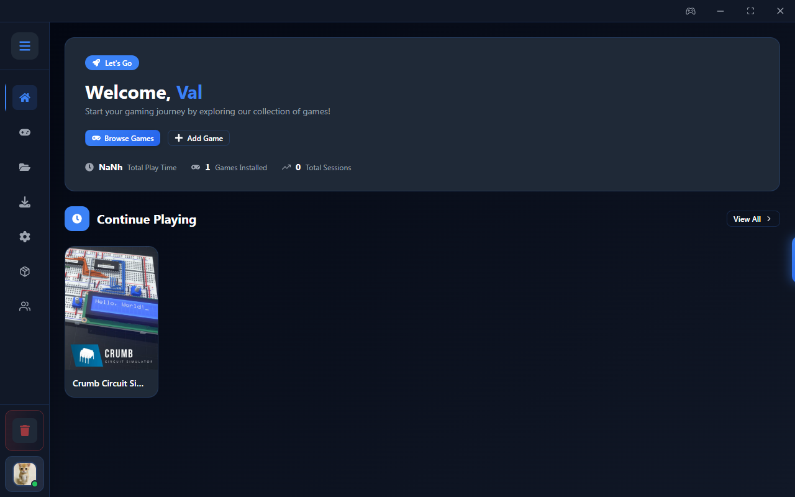
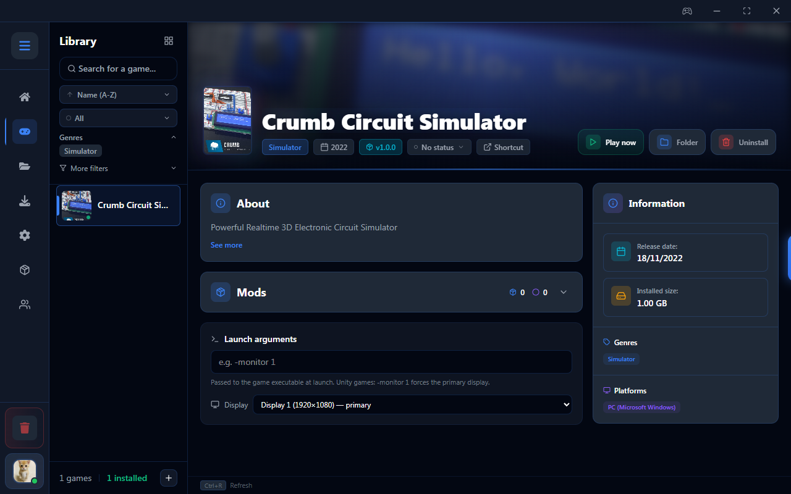
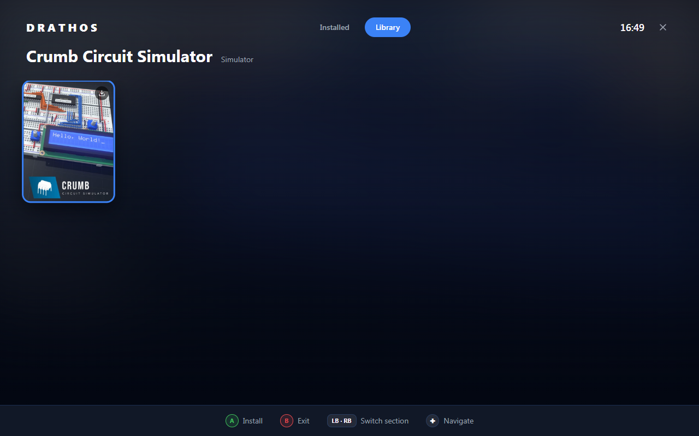
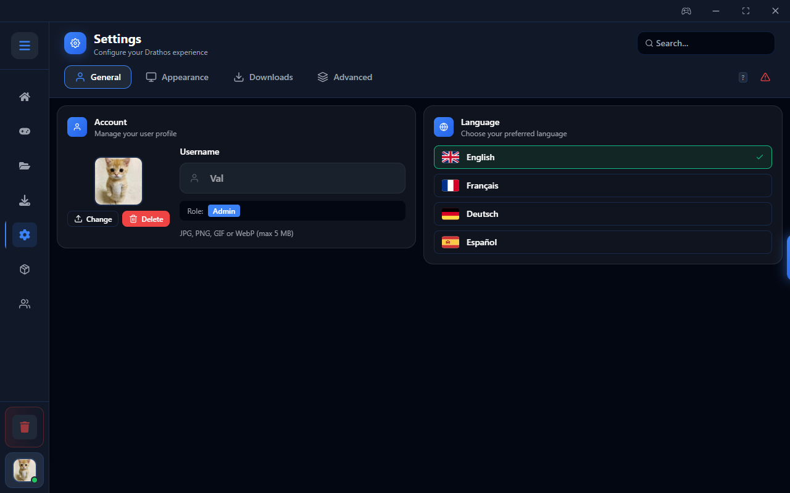
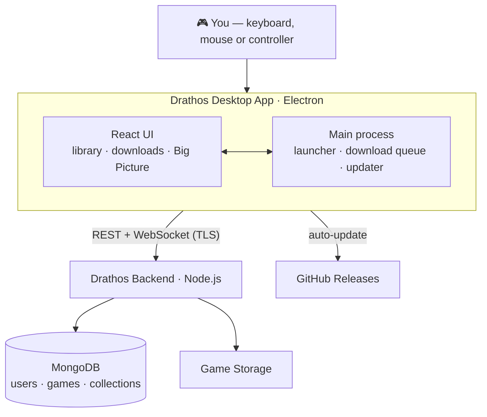

<div align="center">
  <br />
  
  <h1>Drathos</h1>
  <p><strong>DRM-Free Game Library Client</strong></p>
  <p><em>Own your library. Play without DRM. Host it yourself.</em></p>
  <p>Self-hosted · Cross-platform · Open Source</p>

  <p>
    <a href="https://github.com/Valt1-0/drathos/releases/latest"></a>
    <a href="https://github.com/Valt1-0/drathos/releases"></a>
    <a href="https://github.com/Valt1-0/drathos/stargazers"></a>
    
    
    
    <a href="LICENSE"></a>
  </p>

  <p>
    
  </p>

  <br />
</div>

<div align="center">

[Features](#features) · [Screenshots](#screenshots) · [Getting Started](#getting-started) · [Architecture](#architecture) · [Tech Stack](#tech-stack) · [Roadmap](#roadmap) · [Website](https://drathos.vercel.app) · [Backend](https://github.com/Valt1-0/drathos-backend)

</div>

<br />

---

## Why Drathos?

Most game launchers tie you to DRM, forced online accounts, or a proprietary store. **Drathos flips that around.** It's a self-hosted, DRM-free game library client built with Electron and React that connects to a **[backend server you own and run yourself](https://github.com/Valt1-0/drathos-backend)** — so your collection stays entirely under your control.

Manage, download, and sync your games with no third-party DRM and no forced login. Play at your desk with keyboard and mouse, or lean back on the couch with a controller in **Big Picture mode**. Installed games stay launchable even when your server is offline.

<br />

---

## Screenshots

<table>
  <tr>
    <td width="50%"><p align="center"><sub><strong>Home</strong> — stats &amp; recently played</sub></p></td>
    <td width="50%"><p align="center"><sub><strong>Library</strong> — details, launch options &amp; mods</sub></p></td>
  </tr>
  <tr>
    <td width="50%"><p align="center"><sub><strong>Big Picture</strong> — controller-first couch mode</sub></p></td>
    <td width="50%"><p align="center"><sub><strong>Settings</strong> — themes, language &amp; more</sub></p></td>
  </tr>
</table>

<br />

---

## Features

<table>
<tr><td> &nbsp;<strong>Game Library</strong></td><td>Search and browse your catalog · Filter by genre, status, playtime, or multiplayer · Track each game as Backlog / Playing / Completed / Dropped</td></tr>
<tr><td> &nbsp;<strong>Controller &amp; Big Picture</strong></td><td>Navigate the entire app with a gamepad · Full-screen, console-style Big Picture library · Per-game display selection · Custom launch arguments</td></tr>
<tr><td> &nbsp;<strong>Game Launcher</strong></td><td>One-click launch · Wine support on Linux · Install, uninstall, open folder, create desktop shortcut · Stop a running game at any time</td></tr>
<tr><td> &nbsp;<strong>Downloads</strong></td><td>Queue-based installer with real-time progress · Pause, resume, cancel · SHA-256 verification before extraction · Continues in the background while you navigate</td></tr>
<tr><td> &nbsp;<strong>Collections</strong></td><td>Group games into custom collections · Cover mosaic preview · Name, icon, and description per collection</td></tr>
<tr><td> &nbsp;<strong>Stats</strong></td><td>Total playtime, session count, and recently played — all visible from the home screen</td></tr>
<tr><td> &nbsp;<strong>User Management</strong></td><td>View all users, assign roles (Admin / Moderator / Member), manage invite codes, search and sort by playtime or activity <em>(admin only)</em></td></tr>
<tr><td> &nbsp;<strong>Settings</strong></td><td>Profile picture · Language (EN / FR / DE / ES) · 5 built-in themes · Download path, notifications, cache, close-to-tray, SSL</td></tr>
<tr><td> &nbsp;<strong>Offline Mode</strong></td><td>All installed games stay launchable · Pending actions sync automatically when the server is back</td></tr>
<tr><td> &nbsp;<strong>Security &amp; Updates</strong></td><td>Encrypted token storage (safeStorage) with refresh rotation · TOFU certificate pinning for self-hosted servers · Automatic updates via GitHub Releases</td></tr>
</table>

<br />

---

## Getting Started

### Download

Pre-built installers for **Windows** (`.exe`) and **Linux** (`.AppImage`, `.deb`, `.pacman`) are available on the [Releases page](https://github.com/Valt1-0/drathos/releases/latest). The app updates itself automatically from there.

A running [Drathos backend](https://github.com/Valt1-0/drathos-backend) instance is required — enter its address on first launch.

### Build from source

**Prerequisites:** Node.js ≥ 20 · A running [Drathos backend](https://github.com/Valt1-0/drathos-backend) instance

```bash
git clone https://github.com/Valt1-0/drathos.git
cd drathos
npm install
cp .env.example .env   # set your backend URL
npm run dev            # development mode
```

### Package installers

```bash
npm run dist           # build for the current platform
npm run dist:win       # Windows  (NSIS installer)
npm run dist:linux     # Linux    (AppImage + DEB + PACMAN)
npm run dist:mac       # macOS    (DMG)
```

<br />

---

## Architecture



The desktop client is fully self-contained: it handles game launching, the download queue, and updates locally, and talks to **your** backend only for catalog, auth, and sync. Installed games remain playable with no connection at all.

<br />

---

## Tech Stack

| Layer | Technology |
|---|---|
| **Runtime** | [Electron 43](https://www.electronjs.org/) (Chromium + Node.js) |
| **UI** | [React 19](https://react.dev/) · [React Router 7](https://reactrouter.com/) · [Framer Motion](https://www.framer.com/motion/) |
| **Styling** | [Tailwind CSS 4](https://tailwindcss.com/) with a themeable design system |
| **Build** | [electron-vite](https://electron-vite.org/) · [Vite 7](https://vite.dev/) · [electron-builder](https://www.electron.build/) |
| **State &amp; data** | React Context · [electron-store](https://github.com/sindresorhus/electron-store) · [Socket.IO](https://socket.io/) |
| **i18n** | [i18next](https://www.i18next.com/) — English, French, German, Spanish |
| **Quality** | [ESLint](https://eslint.org/) · [Prettier](https://prettier.io/) · [Vitest](https://vitest.dev/) · GitHub Actions CI |

<br />

---

## Roadmap

- [x] Windows &amp; Linux builds (NSIS · AppImage · DEB · PACMAN)
- [x] Full controller navigation &amp; Big Picture mode
- [x] Offline mode with background sync
- [x] Automatic updates via GitHub Releases
- [x] Collections, mods, and multi-user roles
- [ ] macOS build
- [ ] In-app patch notes viewer
- [ ] Additional interface languages

> Suggestions and feature requests are welcome — [open an issue](https://github.com/Valt1-0/drathos/issues).

<br />

---

## Changelog

**v1.1.0** — Full controller navigation · Big Picture mode · Per-game display selection · Custom launch arguments · Close to system tray · Safer default install folder · GitHub issue bug reports · Electron 43

**v1.0.0** — Open source release · GPL-3.0 licence · Security hardening (safeStorage, token refresh, CSP) · 4-language i18n (EN / FR / DE / ES) · Auto-update via GitHub Releases

**v0.8.0** — Desktop shortcuts · Loading animations · Accessibility improvements · Disk space monitoring · Game watchdog

**v0.7.0** — User role management · User status & filters · QuickLaunch overlay · Docker build support

**v0.6.0** — Advanced game filtering · Adaptive offline detection · Notification system · Self-signed SSL support

**v0.5.0** — Mod management (upload, install, uninstall) · User profiles · Connection status in settings

**v0.4.0** — Collections — group games into custom collections · UI improvements

**v0.2.0** — Initial release · EN/FR i18n · Virtualized game library · Download manager

<br />

---

## Legal Disclaimer

Drathos is a **self-hosted client application** — it does not host, distribute, or provide access to any games or content. It connects exclusively to a backend server that you own and operate yourself.

You are solely responsible for ensuring that any content uploaded to your server complies with applicable copyright laws and the terms of any relevant licenses. The developers of Drathos do not condone piracy or any unauthorized distribution of copyrighted material.

This software is provided "as is", without warranty of any kind. See the [LICENSE](LICENSE) for details.

<br />

---

## Contributing

Contributions are welcome. See [CONTRIBUTING.md](CONTRIBUTING.md) for development setup and pull request guidelines, and read the [Code of Conduct](CODE_OF_CONDUCT.md) before participating. To report a vulnerability privately, see [SECURITY.md](SECURITY.md).

<br />

---

<div align="center">
  <br />
  <sub>Built with ❤️ by <strong>Valt</strong></sub>
  <br />
  <sub><a href="https://drathos.vercel.app">drathos.vercel.app</a> · <a href="https://github.com/Valt1-0/drathos">github.com/Valt1-0/drathos</a></sub>
  <br /><br />
</div>
